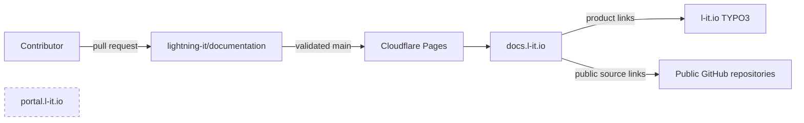

# Architecture

## Purpose

Lightning IT Documentation is a fully static Docusaurus application published
to Cloudflare Pages. It provides public technical navigation across the four
peer products while keeping marketing, customer, and private operating content
in their existing systems.

## System context

`l-it.io` and `portal.l-it.io` are external peers, not deployment targets or
upstreams. The documentation site does not proxy or modify either service.

## Build and runtime

The build uses Node.js 24 LTS, npm lockfile installation, Docusaurus 3.10.2,
TypeScript, Markdown/limited MDX, and Pagefind 1.5.2. Docusaurus emits the static
site to `build/`; Pagefind indexes that output and places its static search
assets inside the same directory. No application server or search service is
required at runtime.

Cloudflare serves HTML and hashed assets. `static/_headers` supplies the
content-security, framing, MIME, referrer, permissions, and cache policies.
`static/_redirects` contains reviewed one-hop redirects. Canonical metadata,
sitemap, robots policy, and the custom 404 page are generated or copied during
the build.

## Information architecture

The landing page is task- and audience-oriented. Product sections use
consistent concepts where content exists, while cross-product architecture,
security, compliance, reference, releases, support, and contribution material
have canonical top-level sections. Sidebars are explicit and reviewed so a
filesystem move cannot silently alter public navigation.

## Search

Pagefind runs after the production build and indexes rendered headings and body
text. The browser loads only the static search runtime and index shards needed
for a query. Search requires no query telemetry or third-party network request.
The UI supports keyboard operation, visible result focus, snippets, and result
highlighting.

## Trust boundaries

- Public repository content is untrusted until classification, review, and CI
  succeed.
- Fork pull requests receive no deployment credentials.
- Public builds do not fetch private repositories.
- Component-derived references may use only public immutable sources.
- GitHub workflows have read-only default permissions and immutable action
  references.
- Cloudflare deployment authority is separate from content review authority.

## Deployment and rollback

`develop` is the default integration branch. `main` is the protected stable and
Cloudflare production branch. Pull-request previews are disposable and must not
be indexed. Production promotion repeats validation, retains the static artifact
and software bill of materials, and performs public acceptance against the
specific source revision reported by Cloudflare Pages.

Rollback selects the previous accepted Pages deployment or reverts the
production commit through a pull request. DNS is not changed for ordinary
content rollback. A failed deployment must leave the previous production
version serving.

## Architecture decisions

- Static rendering minimizes operational and data-processing surface.
- Local static search avoids an unnecessary query processor.
- Explicit sidebars and metadata validation favor reviewability.
- Mermaid is preferred over screenshots for maintainable public diagrams.
- Product documentation and product marketing remain intentionally separate.
