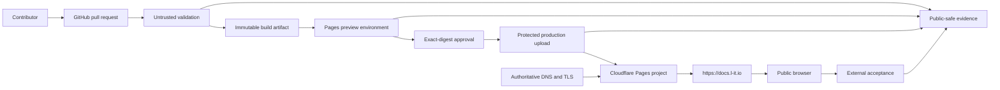

<!-- cspell:words cicd cloudflare noarchive -->

# CI/CD and Cloudflare deployment architecture

This planning record is the implementation handoff for #40. It does not change
Cloudflare, DNS, credentials, workflows, branches, or production. Issue #38
must approve this architecture before #40 executes it.

## Architecture states

| State      | Verified or approved position                                                                                                                                        |
| ---------- | -------------------------------------------------------------------------------------------------------------------------------------------------------------------- |
| Current    | Static Docusaurus build, Pagefind, `build/`, Cloudflare Pages previews/production, `develop` integration, `main` stable; workflows validate previews and production. |
| Transition | #40 pins the deployment client, introduces immutable artifact upload/promotion, reconciles Git-connected settings, and verifies the custom domain.                   |
| Target     | One validated candidate artifact is uploaded unchanged to preview or production through separated protected environments and externally accepted.                    |

Repository evidence shows designed behavior, not current dashboard, DNS,
certificate, credential, or production-revision state. #40 begins with
read-only control-plane preflight and records safe observations privately.

## End-to-end context



Trust boundaries separate untrusted authoring/PR input, validation, preview,
protected promotion, Cloudflare account/zone control, public DNS/TLS, and
external acceptance. Production credentials exist only at the protected
promotion boundary.

## Components and sources of truth

| Component/configuration     | Responsibility/source of truth                                       | Accountable role            |
| --------------------------- | -------------------------------------------------------------------- | --------------------------- |
| content and site source     | tracked repository at exact Git commit                               | Documentation Maintainers   |
| dependency/tool versions    | `.node-version`, `package.json`, `package-lock.json`                 | Repository Maintainers      |
| site configuration          | `docusaurus.config.ts`, `sidebars.ts`, `static/`, `src/`, `scripts/` | Documentation Maintainers   |
| validation policy           | tracked npm scripts and pinned GitHub workflows                      | Repository Maintainers      |
| candidate artifact          | retained workflow artifact plus SHA-256 manifest                     | Build and Release Owner     |
| public evidence             | schema-governed Evidence Center records                              | Evidence Owner              |
| Pages project desired state | tracked public-safe contract; restricted IDs/secrets outside Git     | Delivery Engineer           |
| Pages effective state       | Cloudflare control plane, reconciled against desired state           | Delivery Engineer           |
| DNS/custom domain/TLS state | authoritative Cloudflare zone/control plane                          | DNS and TLS Owner           |
| preview admission           | GitHub `preview` environment and workflow policy                     | Preview Approver            |
| production admission        | protected `production` GitHub environment                            | Production Approver         |
| acceptance result           | external checks plus named human usability review                    | Production Acceptance Owner |
| rollback decision           | incident/change record and previous accepted artifact                | Production Approver         |

## Reproducible build contract

| Item               | Exact target                                                                         |
| ------------------ | ------------------------------------------------------------------------------------ |
| repository/root    | `lightning-it/documentation`, repository root                                        |
| integration/stable | `develop` / `main`                                                                   |
| Node/npm           | Node 24.18.0 from `.node-version`; npm 11.x constrained by `package.json`            |
| framework          | Docusaurus 3.10.2; React 19.2.7; TypeScript 6.0.3                                    |
| search             | Pagefind 1.5.2                                                                       |
| deployment client  | Wrangler 4.114.0, pinned exactly as a development dependency by #40                  |
| install            | `npm ci` in repository root                                                          |
| validation         | `npm run validate:release`                                                           |
| production build   | `npm run build`                                                                      |
| local preview      | `npm run serve -- --port 3000`                                                       |
| output             | `build/`                                                                             |
| site config        | `docusaurus.config.ts`; `url=https://docs.l-it.io`, `baseUrl=/`                      |
| static inputs      | `static/`; docs and generated public sources validated before build                  |
| generated outputs  | deployment marker, Pagefind under `build/pagefind/`, CSP hashes, license/NOTICE data |

Clean checkout exit criteria: install exits zero without lockfile changes;
validation/build exit zero; no tracked diff; `build/` contains HTML, assets,
Pagefind, `_headers`, `_redirects`, `robots.txt`, sitemap, 404, manifest,
deployment marker, and notices; no secret or restricted sentinel; second clean
build has the same semantic artifact digest.

The candidate archive is named
`documentation-site-<full-commit>-<sha256>.tar.gz`. Canonical manifest order,
normalized archive ownership/mode/time, and SHA-256 make it deterministic. The
workflow retains archive, manifest, CycloneDX SBOMs, public provenance, and
validation summaries under the #30 retention class. The archive itself is
uploaded once and never rebuilt for promotion.

Required build inputs are tracked source, exact commit, locked toolchain, and
`NODE_ENV=production`. Optional public inputs are `BASE_URL` only in explicit
test harnesses and synthetic expected commit/URL values. Production build
content must not depend on secrets, Cloudflare identifiers, current time,
network-fetched private data, or mutable external sources.

## Cloudflare Pages contract

| Setting                  | Approved target                                                                                                  |
| ------------------------ | ---------------------------------------------------------------------------------------------------------------- |
| project                  | `lightning-it-documentation`                                                                                     |
| owner                    | Delivery Engineer role                                                                                           |
| deployment method        | Direct Upload from GitHub Actions using the retained immutable `build/` artifact                                 |
| repository connection    | Git integration disabled for production after verified cutover; GitHub remains source                            |
| root/output              | repository root / `build`                                                                                        |
| install/build            | performed in GitHub with commands above; Cloudflare performs no rebuild                                          |
| runtime/compatibility    | static Pages; no Functions and no compatibility date/flags                                                       |
| production branch label  | `main`                                                                                                           |
| preview branch           | sanitized `pr-<number>-<short-commit>`                                                                           |
| preview URL              | deployment-specific `*.pages.dev`; never treated as stable/canonical                                             |
| production custom domain | `docs.l-it.io`                                                                                                   |
| retention                | preserve current and at least two prior accepted production deployments; previews expire per approved #30 policy |

Direct Upload is selected because Cloudflare Git builds would rebuild after
approval and break build-once promotion. #40 pins Wrangler and uploads the
already validated directory:

```sh
npm exec -- wrangler pages deploy build \
  --project-name lightning-it-documentation \
  --branch "<approved-branch-label>" \
  --commit-hash "<full-git-oid>" \
  --commit-dirty=false
```

The workflow records the returned deployment ID/URL privately and a safe
deployment reference publicly. Account and zone identifiers remain restricted.
Dashboard drift is detected by a read-only preflight comparing project name,
production branch, domains, build mode, Functions absence, preview policy, and
deployment identity to this contract. Drift blocks mutation and produces an
owned reconciliation action.

### Environment and secret inventory

| Name                    | Scope        | Classification  | Source/storage                            | Minimum permission/owner                                         |
| ----------------------- | ------------ | --------------- | ----------------------------------------- | ---------------------------------------------------------------- |
| `CLOUDFLARE_API_TOKEN`  | preview      | restricted      | GitHub `preview` environment              | Pages deploy to named project; Delivery Engineer rotates/revokes |
| `CLOUDFLARE_ACCOUNT_ID` | preview      | restricted here | GitHub `preview` environment              | account selector only; Delivery Engineer                         |
| `CLOUDFLARE_API_TOKEN`  | production   | restricted      | GitHub protected `production` environment | Pages deploy/rollback to named project only                      |
| `CLOUDFLARE_ACCOUNT_ID` | production   | restricted here | GitHub protected `production` environment | account selector only                                            |
| `EXPECTED_COMMIT`       | verification | public          | workflow exact head                       | none                                                             |
| `BASE_URL`              | verification | public          | approved preview/production URL           | none                                                             |

Preview and production tokens are distinct. Neither receives DNS, zone-setting,
certificate, user, billing, Workers, KV, or unrelated-project authority. DNS
and domain binding use a separate short-lived operator credential outside
ordinary CI. Secrets are provisioned out of band, masked, never echoed, rotated
at least annually and on owner/provider/exposure change, revoked before
replacement removal, and audited through GitHub/Cloudflare logs. Break-glass
use requires two-person authorization, time-bounded credential, private
incident record, immediate revocation, and public-safe follow-up if appropriate.

Forks receive no environment secrets and may run public validation only.
Same-repository previews require publication-safe content checks and `preview`
environment admission. Production requires protected `production` environment
approval by an authorized role, independent from the author by default. Under
the documented single-maintainer exception, the authorized maintainer may make
their own protected-environment deployment decision only after the exact
revision has passed independent Copilot review, every finding and required
check is resolved, and the exact documentation and artifact digests are bound
to the approval evidence.

## DNS and TLS contract

The authoritative `l-it.io` zone and zone ID remain restricted. The DNS/TLS
Owner performs:

1. verify no conflicting `docs` record and inventory unrelated `l-it.io` and
   `portal.l-it.io` records without changing them;
2. bind `docs.l-it.io` as a Pages custom domain for project
   `lightning-it-documentation`;
3. create one proxied CNAME: host `docs`, target
   `lightning-it-documentation.pages.dev`, TTL Auto;
4. wait for Cloudflare domain validation and managed certificate issuance;
5. require SSL/TLS Full (strict), minimum TLS 1.2, TLS 1.3 enabled, and Always
   Use HTTPS;
6. verify canonical HTTPS host, certificate chain/SAN/expiry, IPv4 and IPv6
   reachability through Cloudflare anycast, and no mixed content; and
7. preserve existing DNSSEC and compatible CAA policy. A CAA change requires
   separate zone-wide impact review.

No explicit A/AAAA record is added. Cloudflare proxy supplies address families.
HTTP and any Pages production alias redirect one hop to
`https://docs.l-it.io/<same-path-and-query>` where supported. Unknown hosts are
not accepted as canonical.

Ordinary rollback never changes DNS. Domain rollback removes or restores only
the `docs` binding/record after recording its exact prior value, waits for
propagation/certificate state, and re-verifies unrelated records. It is used
only for domain/control-plane failure, not content rollback.

## Delivery stages

| Stage                | Actor/context                | Gate and output                                                                 |
| -------------------- | ---------------------------- | ------------------------------------------------------------------------------- |
| local                | contributor                  | Node 24, `npm ci`, scoped/full validation, clean diff                           |
| pull request         | untrusted GitHub runner      | format, lint, content, types, tests, security/dependency/license                |
| candidate            | trusted read-only builder    | full release validation; deterministic `build/`, archive/digest/SBOM/provenance |
| preview upload       | preview environment          | exact artifact upload; isolated non-indexed URL                                 |
| preview acceptance   | automation + reviewer        | content identity, safe headers, UI/accessibility, limitations                   |
| approval             | authorized human             | exact issue/PR/commit/document/artifact digests                                 |
| stable promotion     | protected PR to `main`       | required checks, no artifact change, production environment approval            |
| production upload    | production environment       | same retained artifact upload to production branch                              |
| external acceptance  | unauthenticated runner/human | DNS/TLS/routes/search/a11y/security/source revision evidence                    |
| evidence publication | Evidence Owner               | reviewed public-safe records; restricted details withheld                       |
| rollback             | Production Approver          | prior accepted artifact redeployed; acceptance repeated                         |

Concurrency keys are project plus environment. A newer preview cancels an older
preview for the same PR. Production never cancels an in-flight upload or
acceptance automatically; it serializes, times out at bounded documented
limits, and requires operator disposition. Retries reuse the same artifact and
are bounded. Any failed gate stops later stages; failed production upload leaves
the last accepted Pages deployment serving.

### Quality-gate matrix

| Gate                                         | PR      | candidate | preview        | production     |
| -------------------------------------------- | ------- | --------- | -------------- | -------------- |
| format, lint, spelling, type                 | yes     | yes       | derived        | derived        |
| metadata, routes, links, anchors, navigation | yes     | yes       | smoke          | representative |
| generated content/migration                  | yes     | yes       | identity       | identity       |
| unit, site, browser, a11y                    | yes     | yes       | yes            | yes            |
| Lighthouse/performance                       | bounded | yes       | yes            | representative |
| secret/content safety                        | yes     | yes       | sentinel       | sentinel       |
| CodeQL/dependency/license/audit              | yes     | yes       | derived        | derived        |
| SBOM/provenance/reproducibility              | no      | yes       | digest         | digest         |
| approval/exact artifact                      | no      | candidate | label          | required       |
| DNS/TLS/headers/cache/robots                 | no      | no        | preview policy | full           |

## Edge and static behavior

`static/_headers` is canonical for CSP, frame protection, MIME sniffing,
referrer, permissions, and cache policy; generated CSP hashes are validated.
Target caching:

- HTML, deployment marker, manifest, sitemap, robots, redirects, and search
  metadata: revalidate (`no-cache` or short bounded max-age);
- Pagefind index shards: bounded cache with versioned integrity;
- fingerprinted JS/CSS/images/fonts: public immutable one-year cache;
- 404: short cache.

`static/_redirects` owns reviewed one-hop redirects. Docusaurus owns canonical
metadata and sitemap. Production `robots.txt` permits intended public indexing
and references the canonical sitemap. Every preview sends `X-Robots-Tag:
noindex, nofollow, noarchive`, includes no production canonical claim, and is
excluded from sitemap discovery. Custom 404 returns the provider-supported 404
status with accessible navigation.

No mandatory runtime third-party script, server function, or external search
request is added. A failed upload or acceptance leaves the prior deployment
serving; cache purge is scoped and follows successful acceptance only.

## Preview and demonstration

Eligible same-repository PRs receive a deployment-specific URL only after
classification and required validation. Forks get no deployment. A handoff
contains preview URL, full source commit, artifact digest, check summary,
publication classification, limitations, roadmap/issue, expiry, and the text
“preview; not accepted production.”

Preview URLs are public and therefore may contain only publication-approved
material. They use non-indexing headers, no sitemap registration, no stable
links from production, and bounded retention. The deployment marker safely
exposes full source commit and artifact digest; it excludes account, zone,
credential, runner, and private deployment identifiers.

## Production acceptance

An unauthenticated runner outside GitHub/Cloudflare sessions plus a named human
executes:

- DNS CNAME resolution, IPv4/IPv6 reachability, certificate/SAN/chain/expiry,
  TLS 1.2/1.3, HTTP-to-HTTPS and canonical-host one-hop redirects;
- expected 200/404 behavior, representative product/cross-product routes,
  hashed assets, no mixed content, and no console errors;
- deployment marker commit/artifact digest equality to approved evidence;
- headers/CSP, cache classes, robots, sitemap canonical URLs, redirects, and
  custom 404;
- Pagefind query, keyboard navigation, result focus/labels, and no restricted
  sentinel;
- desktop/mobile responsive layout, zoom/reflow, skip link, landmarks, heading
  order, keyboard operation, visible focus, contrast, reduced motion, Mermaid
  accessible rendering, and representative screen-reader review; and
- Cloudflare deployment state and previous accepted rollback candidate through
  authorized control-plane inspection.

Machine results and human checklist become #30 evidence with source commit,
artifact/deployment safe IDs, observation time, owner, method, results, and
limitations. Any mandatory failure marks acceptance failed, prevents the
production claim/roadmap completion, and triggers rollback or an owned bounded
remediation decision.

## Rollback and recovery

Ordinary rollback:

1. stop new production promotions;
2. identify the immediately previous accepted artifact and evidence;
3. obtain Production Approver authorization;
4. redeploy that retained artifact to the production branch without rebuild or
   DNS change;
5. repeat external acceptance and record new deployment/rollback evidence; and
6. open remediation for the failed candidate while preserving its evidence.

If direct redeploy is unavailable, create a reviewed revert/promotion from the
previous accepted commit and build a newly identified recovery artifact; never
pretend it is the original artifact.

| Failure              | Recovery                                                                                           |
| -------------------- | -------------------------------------------------------------------------------------------------- |
| custom domain/DNS    | restore recorded `docs` binding/CNAME only; verify propagation/certificate                         |
| certificate          | keep Pages alias available for operator diagnosis; repair binding/CAA safely; no insecure fallback |
| credential           | revoke, provision least-privilege replacement, audit use, retry same artifact                      |
| artifact unavailable | use previous retained accepted artifact or reviewed recovery rebuild                               |
| Cloudflare outage    | stop mutation; retain evidence; serve last available deployment; escalate                          |
| bad cache/header     | rollback artifact/config; scoped purge after accepted recovery                                     |

Recovery-time objectives are assumptions until a Service Owner approves an
SLO: ordinary artifact rollback target 30 minutes; credential/domain recovery
target 4 hours; provider-wide outage follows provider recovery. These are
planning targets, not public availability commitments.

## Implementation command and configuration matrix

| Actor/system        | Location/control plane          | Command or setting                                           | Non-secret input                | Secret reference           | Expected/verification                        | Failure/rollback                    | Evidence                      |
| ------------------- | ------------------------------- | ------------------------------------------------------------ | ------------------------------- | -------------------------- | -------------------------------------------- | ----------------------------------- | ----------------------------- |
| builder             | clean repository root           | `node --version`; `npm --version`                            | Node 24.18.0/npm 11             | none                       | exact supported versions                     | stop                                | toolchain result              |
| builder             | repository root                 | `npm ci`                                                     | lockfile                        | none                       | zero exit, no diff                           | discard workspace                   | install/lock digest           |
| validator           | repository root                 | `npm run validate:release`                                   | source commit                   | none                       | all gates pass                               | stop                                | check/run IDs                 |
| builder             | repository root                 | `npm run build`                                              | validated source                | none                       | complete `build/`                            | stop                                | build manifest                |
| builder             | repository root                 | deterministic archive/digest command implemented by #40      | `build/`, commit                | none                       | archive, SHA-256, reproducible match         | stop                                | artifact/digest               |
| preview deployer    | GitHub `preview` environment    | Wrangler Pages deploy command                                | project, preview branch, commit | preview token/account      | deployment-specific URL and matching commit  | keep prior preview; stop            | safe deployment record        |
| verifier            | public network                  | `npm run test:preview`                                       | preview URL/commit              | none                       | preview checks and noindex pass              | delete/expire preview               | preview acceptance            |
| approver            | GitHub/approval record          | exact-digest approval                                        | issue/PR/commit/artifact/docs   | none                       | authorized immutable record                  | no promotion                        | approval evidence             |
| promoter            | protected `main` PR             | GitHub merge                                                 | accepted commit/artifact        | none                       | required checks and branch ancestry          | stop                                | merge commit                  |
| production deployer | GitHub `production` environment | Wrangler Pages deploy command                                | project, `main`, commit         | production token/account   | production deployment references same digest | redeploy previous accepted artifact | deployment evidence           |
| DNS/TLS owner       | Cloudflare zone                 | Pages custom domain + proxied CNAME                          | `docs`, Pages target, Auto TTL  | short-lived DNS credential | active domain/cert, unrelated diff empty     | restore exact prior `docs` state    | private change + safe summary |
| verifier            | public network                  | `wait:production`, `test:production`, browser/TLS/DNS checks | canonical URL/commit            | none                       | all acceptance gates pass                    | rollback                            | acceptance evidence           |
| rollback operator   | protected production            | redeploy retained previous artifact                          | prior accepted digest           | production token/account   | prior digest serving and accepted            | escalate recovery                   | rollback evidence             |

Issue #40 must implement missing deterministic archive/upload orchestration and exact
read-only drift checks using reviewed scripts rather than ad hoc shell logic.
Commands receive explicit validated values; unresolved variables, wildcards,
secret output, and broad control-plane mutation are prohibited.

## Decisions, risks, and #40 handoff

Accepted target decisions:

- Direct Upload, not Cloudflare Git rebuild, enforces immutable promotion.
- `develop` integrates; protected `main` represents stable production intent.
- preview and production use distinct environments/tokens and admission rules.
- ordinary rollback redeploys an accepted artifact without DNS change.
- the canonical host is HTTPS `docs.l-it.io`; Pages aliases are non-canonical.
- current target project is `lightning-it-documentation`; restricted IDs stay
  outside public artifacts.

Required implementation ADRs record Direct Upload/cutover, environment
separation, artifact canonicalization, DNS/custom-domain state, cache/header
policy, and rollback/SLO assumptions. They may not reverse the accepted
architecture without returning to the architecture gate.

Known risks are dashboard drift, Git-integration double deployment, overly
broad tokens, Cloudflare upload retention, DNS/CAA interaction, nondeterministic
archives, stale previews, and provider outage. Preflight, direct-upload cutover,
least privilege, retained accepted artifacts, exact DNS diff, reproducibility,
expiry, and recovery controls address them.

Issue #40 is implementation-ready only after #38 approval and must trace each change
to #15, #35, and #40; record PR/commit/check/artifact/deployment/acceptance
evidence; and leave no open architecture choice. Restricted account, zone,
token, audit, and control-plane observations stay private.
