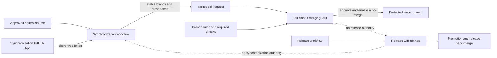
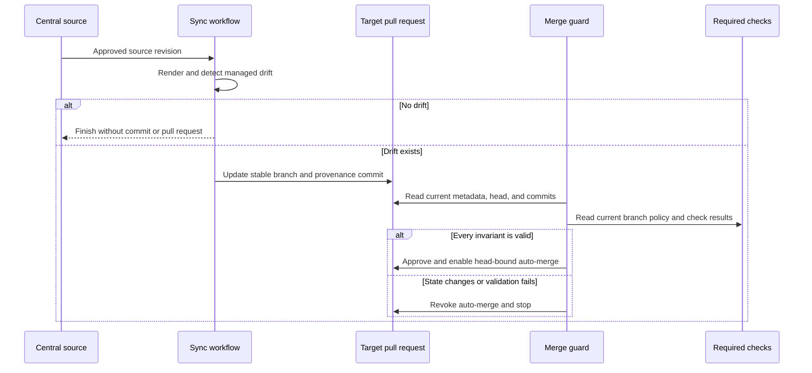

# GitHub automation trust architecture

Lightning IT uses GitHub Apps as short-lived workload identities for centrally
managed repository changes. Synchronization and release operations use separate
Apps so that compromise or failure in one workflow does not grant authority to
the other.

This page describes the public trust model and its security invariants. Exact
repository inventories, application identifiers, secret names, installation
details, operational evidence, and recovery material remain in approved private
systems.

## Scope

The architecture covers two automation classes:

- **repository synchronization** distributes approved shared assets and manages
  the resulting pull request lifecycle; and
- **release automation** performs authorized promotion and release back-merges.

The two classes do not share a human service account. A retired human automation
identity is not part of the active trust path.

## Trust boundaries

### Central source boundary

Shared assets have one approved source. A target repository does not become a
second source merely because it contains a synchronized copy. Changes to a
managed block are made at the central source and distributed from there.

### Workload identity boundary

Each GitHub App receives only the permissions and repository installation scope
required for its automation class. Workflows mint short-lived installation
tokens at run time. Long-lived personal access tokens and human service accounts
are not part of the design.

### Protected branch boundary

Automation writes a pull-request branch, not the protected target branch. Branch
rules, required checks, and the independent guard remain authoritative for the
merge decision.

## Synchronization lifecycle

Each target repository and synchronization category has one stable branch name.
A later run updates the same branch and pull request instead of creating a
timestamped queue of competing changes.

The synchronization commit records the immutable source revision and workflow
run identifier. The App identifier is also bound to the commit provenance. This
allows the guard to distinguish a current automated change from a look-alike
branch, title, or author.

## Fail-closed merge decision

The guard approves a synchronization pull request only when all of these
conditions are true at the time of the decision:

- the event actor, pull-request author, commit authors, and committers resolve to
  the approved synchronization App;
- the App identity matches the configured application identifier;
- the base branch, stable head branch, exact title, and required labels match the
  synchronization category;
- every commit contains exactly one valid source revision, source run, and App
  provenance field;
- the last verified commit is still the live pull-request head;
- the branch has not been replaced or modified by a human or another workload;
- the current branch rules can be read and all required checks have succeeded;
  and
- auto-merge is bound to the verified head commit.

The guard re-reads live state while it waits. Missing policy data, ambiguous
provenance, API failure, an unexpected commit, a head race, or a failed check is
an error, not permission to continue. If auto-merge was previously enabled, the
guard removes it when the state becomes untrusted.

## Superseded pull requests

Stable branches prevent new duplicate pull requests. A cleanup step exists for
older branch schemes, but it acts only on candidates whose base branch, title,
branch prefix, bot identity, and provenance are all independently verified.

Cleanup closes the superseded pull request and deletes its branch only after
validating both the current and candidate heads. Human-authored, mixed-author,
or unverifiable changes are never closed automatically. They require maintainer
review.

## Release automation separation

Promotion and release back-merge use a separate GitHub App. The release App does
not inherit the synchronization App's branch contract, and the synchronization
App cannot perform release operations. This separation limits privilege and
makes audit evidence attributable to one automation purpose.

Removing a legacy human automation account is safe only after repository,
organization, team, workflow, secret, promotion, and release dependencies have
all been migrated and independently verified.

## Failure and recovery behavior

| Condition                                | Safe behavior                                             |
| ---------------------------------------- | --------------------------------------------------------- |
| No managed drift                         | Finish without a commit, branch update, or pull request   |
| Required check pending                   | Wait within a bounded polling window                      |
| Required check fails                     | Do not approve or merge                                   |
| Pull-request head changes during polling | Revoke auto-merge and stop                                |
| Provenance cannot be verified            | Leave the pull request for manual review                  |
| Target branch advances                   | Re-render from the current base on the same stable branch |
| App token expires                        | Stop; a later workflow run mints a new short-lived token  |
| App is unavailable or revoked            | Stop without falling back to a human credential           |

Recovery favors a new idempotent workflow run. Administrators do not bypass the
guard to make an uncertain synchronization succeed. If a target repository has
a legitimate local exception, maintainers resolve ownership and policy before
the central source or synchronization scope changes.

## Verification and review

The implementation must include automated tests for identity boundaries, exact
metadata, provenance cardinality, stale-head races, auto-merge revocation,
stable branch reuse, superseded candidate validation, and branch deletion.
Rollout verification must also include a second synchronization run: after all
valid pull requests merge, the same source revision must produce no further
drift.

Operational logs and detailed audit evidence retain their private
classification. Public documentation records the control design, not evidence
that a particular production run succeeded.

Review this architecture at least semiannually and whenever an App permission,
repository scope, branch rule, required check, synchronization category, release
path, or credential lifecycle changes.

See [Integration decisions](./integration-decisions.md) for the decision record
used when another automation crosses this trust boundary, and the
[public documentation boundary](../security/publication-boundary.md) for
publication requirements.
