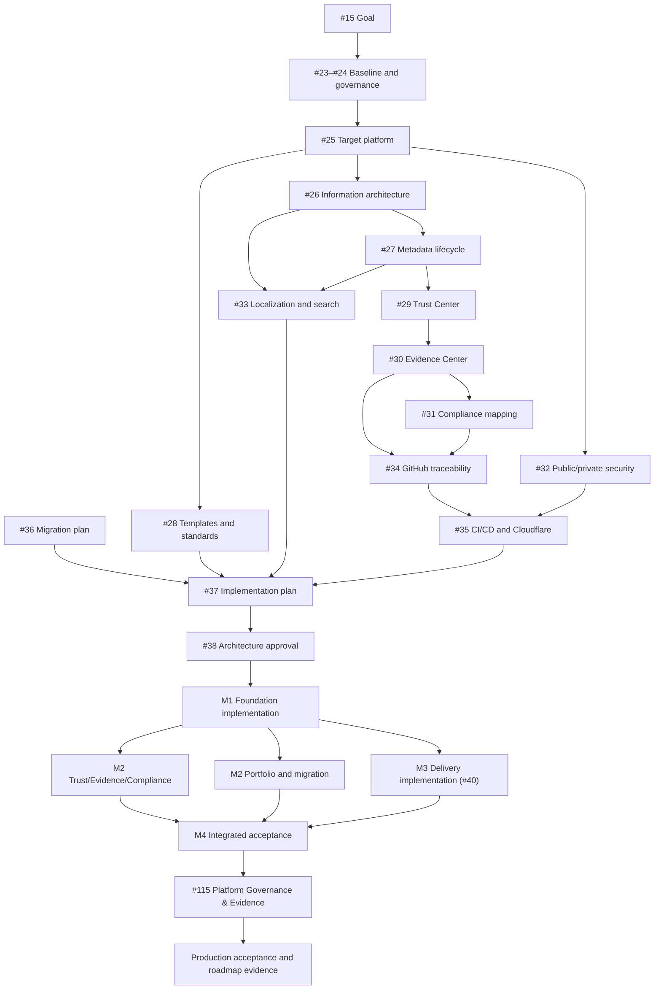

<!-- cspell:words cloudflare workstream -->

# Architecture dependency graph and implementation plan

This planning record turns the #23–#36 architecture package into bounded
implementation work. Every implementation issue remains Todo and blocked by
Issue #38. No branch, pull request, configuration, deployment, or production change
may begin until the authorized maintainer records the exact approval.

## Dependency graph



## Gate and execution rules

- #38 is the architecture-approval and implementation-authorization gate.
- Approval is valid only for the complete document set and deterministic digest
  recorded through #2. A changed package returns to review.
- Implementation issues remain Todo, have no implementation branch/PR, and
  carry a blocking dependency on #38 until that gate is satisfied.
- Each issue has one primary scope and one PR. Generated or migration outputs
  needed by that scope may accompany it when explicitly listed.
- Parallel work may start only when shared schemas/routes/registries are merged,
  not merely proposed in another branch.
- Production mutation remains independently protected even after architecture
  approval.

## Gap disposition

| Confirmed gap                                    | Disposition                                               |
| ------------------------------------------------ | --------------------------------------------------------- |
| governance/license text inconsistencies          | #132 reconcile                                            |
| incomplete metadata/lifecycle schema             | #133 replace current schema compatibly                    |
| target routes/navigation absent                  | #134 reconcile and extend                                 |
| product/foundation taxonomy and page contract    | #135 migrates the taxonomy approved through #147          |
| Trust Center absent                              | #136 extend existing canonical pages                      |
| unified Evidence Center absent                   | #137 reconcile existing evidence and extend               |
| framework-neutral compliance model absent        | #138 extend current BSI page                              |
| bilingual governance/version-aware search absent | #139 extend; English remains operational fallback         |
| end-to-end GitHub traceability absent            | #140 extend existing issue/workflow links                 |
| migration inventory not executed                 | #141 execute approved classifications                     |
| immutable Pages promotion incomplete             | existing #40 implements                                   |
| Platform Governance & Evidence page absent       | existing #115 implements the fifth product after #147     |
| final cross-workstream acceptance absent         | #142 validate/integrate                                   |
| current Docusaurus/build/search baseline         | retain and validate; no rewrite                           |
| current public/private boundary                  | retain; extend validators only through listed issues      |
| private source migration                         | external dependency; remains private and owner-controlled |

## Milestone plan

| Milestone                | Entry criteria                          | Exit criteria                                                                      | Owner                         | Main risks/review point                         |
| ------------------------ | --------------------------------------- | ---------------------------------------------------------------------------------- | ----------------------------- | ----------------------------------------------- |
| M0 Approval              | #23–#37 merged; package digest prepared | #38 human authorization and valid #2 evidence                                      | Architecture Approver         | inconsistent package; full review               |
| M1 Foundations           | M0; registries/route decisions final    | #132–#134 merged; compatibility/migration fixtures pass                            | Repository Maintainers        | schema/route breakage; architecture review      |
| M2 Public models         | M1                                      | #135–#141 merged; Trust/Evidence/Compliance/locale/traceability and migration pass | Product/Trust/Evidence Owners | unsafe claims/data; security/content review     |
| M3 Delivery              | M1 and #35 accepted                     | #40 immutable preview/production path implemented but not yet claimed accepted     | Delivery Engineer             | credentials/DNS/drift; production change review |
| M4 Integrated acceptance | M2 and M3; exact candidate              | #142 and #40 external acceptance pass; rollback ready; evidence approved           | Production Acceptance Owner   | integration gaps; go/no-go                      |
| M5 Product delivery      | M4 shared platform accepted             | #115 approved, deployed, production-verified, canonical source/roadmap updated     | Product Owner                 | taxonomy/claims; product acceptance             |

M2 product/content and M3 delivery can run in parallel after M1. Issue #137
precedes #138 and #140. Issues #139 and #141 may run in parallel after the
foundation issues #133 and #134.
Production acceptance and #115 are on the critical path after convergence.

## Implementation issue contract

Every created issue uses parent #15, type Task, status Todo, its named milestone,
labels `phase:implement` plus domain, accountable owner role, #38 blocker, scope,
exclusions, dependencies, deliverables, acceptance, validation, evidence, and
rollback/migration needs. The issue numbers below are the created Todo
sub-issues of #15 and remain blocked by #38.

### [Issue #132](https://github.com/lightning-it/documentation/issues/132) — reconcile repository governance and licensing implementation

- Milestone/type/labels: M1; Task; `phase:implement`, `governance`, `licensing`.
- Owner/dependencies: Repository Maintainer; #24 and #38.
- Scope/deliverables: normalize MIT declarations in package metadata,
  contributor guidance, README/badges, and managed inventory; preserve
  third-party licenses; add consistency validation.
- Exclusions: no product taxonomy, dependency relicensing, release publication,
  or legal assertion beyond approved repository license.
- Acceptance: every first-party declaration matches `LICENSE` and GitHub
  metadata; notices remain complete; validator fails a synthetic mismatch.
- Validation/evidence: format/lint/types/content/licenses/build, dependency
  license inventory, exact diff and approval record.

### [Issue #133](https://github.com/lightning-it/documentation/issues/133) — implement metadata v2, lifecycle registries, and approval invariant

- Milestone/type/labels: M1; Task; `phase:implement`, `metadata`, `governance`.
- Owner/dependencies: Documentation Maintainer; #27, #30, #38.
- Scope/deliverables: schemas and registries, compatibility reader, effective
  approval calculation, review triggers, relationship validation, migration
  report and fixtures.
- Exclusions: bulk route/taxonomy migration and invented approval evidence.
- Acceptance: controlled values/transitions pass; invalid approval, expired
  exception, duplicate identity, unknown owner/product, and stale relationship
  fail; v1 compatibility has no semantic broadening.
- Validation/evidence: schema/unit/content tests, deterministic digest fixtures,
  migration report, approval/evidence records.

### [Issue #134](https://github.com/lightning-it/documentation/issues/134) — implement information architecture, canonical routes, and navigation

- Milestone/type/labels: M1; Task; `phase:implement`, `navigation`,
  `accessibility`.
- Owner/dependencies: Documentation Maintainer; #26, #133, #38.
- Scope/deliverables: top-level landing/navigation structure, canonical
  ownership registry, explicit sidebars, breadcrumbs, redirects, orphan and
  duplicate checks.
- Exclusions: unapproved product renames, empty Trust/Evidence placeholders,
  and redirect removal.
- Acceptance: all current pages have one canonical location/owner; one-hop
  redirects preserve published paths; desktop/mobile/keyboard/screen-reader
  navigation passes; no orphan/duplicate/broken route.
- Validation/evidence: route/link/anchor/site/browser/a11y tests, redirect and
  navigation inventories, before/after route evidence.

### [Issue #135](https://github.com/lightning-it/documentation/issues/135) — reconcile portfolio taxonomy and adopt product documentation standard

- Milestone/type/labels: M2; Task; `phase:implement`, `products`, `migration`.
- Owner/dependencies: Product Owner; #28, #133/#134, #36, #38, and the
  superseding taxonomy decision in #147.
- Scope/deliverables: approved product/foundation namespaces, landing pages,
  metadata/template adoption, route redirects, shared-content links.
- Exclusions: new product capabilities or claims, marketing copy, and private
  source import.
- Acceptance: each approved product has one owner/canonical entry, foundation
  roles are unambiguous, existing routes remain valid, required/conditional
  sections and public claim evidence pass.
- Validation/evidence: product matrix, route/search/a11y/responsive/link tests,
  migration decisions and exact approval.

### [Issue #136](https://github.com/lightning-it/documentation/issues/136) — implement the public Trust Center

- Milestone/type/labels: M2; Task; `phase:implement`, `trust`, `security`.
- Owner/dependencies: Trust Owner; #29, #133/#134, #32, #38.
- Scope/deliverables: canonical Trust landing/topic pages, claim-type
  presentation, owner/review model, cross-links to existing policies.
- Exclusions: restricted findings/risks/audits/incidents/operations and
  unsupported certification/effectiveness claims.
- Acceptance: every #15 topic is covered or an owned safe gap; current,
  policy, target, planned, evidence, external, and unverified claims are
  distinguishable; every objective claim is scoped and evidenced.
- Validation/evidence: claim/content-safety tests, owner/topic matrix,
  links/search/a11y, security and approval review.

### [Issue #137](https://github.com/lightning-it/documentation/issues/137) — implement the Evidence Center and retention controls

- Milestone/type/labels: M2; Task; `phase:implement`, `evidence`, `security`.
- Owner/dependencies: Evidence Owner; #30, #133/#134, #32, #38.
- Scope/deliverables: schemas/registries, normalized source records,
  deterministic generator/index/manifest, status views, supersession,
  tombstones, public/protected boundary, retention enforcement.
- Exclusions: migration of raw restricted artifacts into Git and default
  success for missing/not-applicable controls.
- Acceptance: all records are attributable/versioned/claim-linked; deterministic
  rebuild matches; leakage sentinels fail closed; failure/unavailable/withheld/
  expired/revoked states remain visible.
- Validation/evidence: schema/unit/reproducibility/content/security/a11y tests,
  inventory disposition, manifest/digests, protected-review attestation.

### [Issue #138](https://github.com/lightning-it/documentation/issues/138) — implement framework-neutral compliance mappings

- Milestone/type/labels: M2; Task; `phase:implement`, `compliance`, `evidence`.
- Owner/dependencies: Compliance Owner; #31, #133/#137, #38.
- Scope/deliverables: framework/requirement/mapping registries, BSI migration,
  applicability/status/assurance views, evidence joins, exception and version
  governance.
- Exclusions: default implemented states, copied restricted standard text,
  certification/regulatory/legal claims without authority.
- Acceptance: all #15 frameworks are registered or explicitly not yet
  assessed; required statuses work; implemented statements enforce current
  evidence; not-applicable has rationale/review; summaries preserve denominators.
- Validation/evidence: mapping/schema/link/digest/accessibility tests, BSI
  migration report, claim review and approval.

### [Issue #139](https://github.com/lightning-it/documentation/issues/139) — implement German localization and version-aware search

- Milestone/type/labels: M2; Task; `phase:implement`, `localization`, `search`.
- Owner/dependencies: Documentation/Locale Owner; #33, #133/#134, #38.
- Scope/deliverables: locale registry/routes/switching, governed English-to-
  German workflow, freshness states, deterministic partitioned Pagefind
  manifests, status/version/product filters and ranking.
- Exclusions: unreviewed machine output, private query telemetry, draft/
  restricted indexing, and silent stale fallback.
- Acceptance: representative English/German identity and fallback pass; machine
  translations require human review; current/historical/deprecated/unsupported/
  planned/draft behavior is explicit; leakage/determinism/performance/a11y pass.
- Validation/evidence: locale drift and route tests, search fixtures/sentinels,
  clean digest comparison, keyboard/screen-reader/performance evidence.

### [Issue #140](https://github.com/lightning-it/documentation/issues/140) — implement public GitHub lifecycle traceability

- Milestone/type/labels: M2; Task; `phase:implement`, `github`, `evidence`.
- Owner/dependencies: Repository Maintainer; #34, #133/#137/#138, #38.
- Scope/deliverables: public allowlist/query contracts, immutable snapshot/cache,
  typed lifecycle graph, issue/project conventions, generated reviewable index.
- Exclusions: private-repository permission/access, public claims from mutable
  labels/badges, and silent truncated/stale generation.
- Acceptance: Goal/task/ADR/PR/review/commit/test/evidence/release/version links
  navigate; every generated reference has public repo and immutable ID;
  malformed/unauthorized/rate-limited inputs fail clearly; least privilege holds.
- Validation/evidence: public fixtures, pagination/rate/cache/failure tests,
  permission inspection, deterministic snapshot/output digests.

### [Issue #141](https://github.com/lightning-it/documentation/issues/141) — execute governed content and evidence migration

- Milestone/type/labels: M2; Task; `phase:implement`, `migration`, `content`.
- Owner/dependencies: Migration Owner; #36, #133–#140 as applicable, #38.
- Scope/deliverables: execute retain/extend/reconcile/replace/retire decisions in
  bounded batches, preserve provenance/redirects, resolve duplicates, record
  deferred/private owners.
- Exclusions: unclassified private source import, invented missing facts, and
  bulk approval transfer.
- Acceptance: every inventory item has completed disposition/evidence or
  explicit external dependency; canonical routes/IDs/claims preserved; no
  duplicate canonical content; rollback manifest exists.
- Validation/evidence: inventory diff, routes/links/search/content/a11y/security
  tests, batch digests, owner approvals and rollback evidence.

### Existing #40 — implement and accept immutable Cloudflare delivery

- Milestone/type/labels: M3; existing Task #40; `phase:implement`,
  `deployment`, `cloudflare`.
- Owner/dependencies: Delivery Engineer; #35, #132–#134, #38.
- Scope/deliverables: exactly the #35 command/configuration matrix, pinned
  Wrangler, deterministic artifact, environment separation, Direct Upload,
  drift preflight, custom domain/DNS/TLS, previews, acceptance and rollback.
- Exclusions: unrelated zone/project changes, credential publication, private
  source access, or production claim before external acceptance.
- Acceptance/validation/evidence: #40 criteria plus exact commit/artifact/
  deployment identity, public DNS/TLS/site/a11y/search/security checks, retained
  rollback candidate and tested rollback.

### [Issue #142](https://github.com/lightning-it/documentation/issues/142) — integrated platform migration and production acceptance

- Milestone/type/labels: M4; Task; `phase:implement`, `acceptance`, `evidence`.
- Owner/dependencies: Production Acceptance Owner; #135–#141 and #40.
- Scope/deliverables: cross-workstream consistency, complete routes/search/
  metadata/claim/evidence/framework/lifecycle verification, external human and
  machine acceptance, limitation/roadmap update, rollback exercise.
- Exclusions: new product feature work and acceptance of failed/unverified
  criteria by omission.
- Acceptance: all required gates pass on one immutable production candidate;
  no open blocker, unsafe claim, restricted leak, orphan, broken relationship,
  stale required translation/evidence, or unowned exception; rollback verified.
- Validation/evidence: full `npm run validate:release`, production suite, independent
  browser/a11y/security review, evidence catalog/digest and go/no-go record.

### Existing #115 — publish Platform Governance & Evidence

- Milestone/type/labels: M5; existing Task #115; product/content.
- Owner/dependencies: Product Owner; M4, #2 exact document approval, current
  migration plan.
- Scope/deliverables: approved page and navigation using shared models,
  production verification, public-safe evidence, roadmap and canonical
  external source update only after live acceptance.
- Exclusions: unverified product capabilities, private source content, and
  external source updates before production truth.
- Acceptance/validation/evidence: #115 criteria, product standard, exact digest,
  build/search/a11y/security/links, production content identity and screenshots/
  records safe for public use.

## Critical path and parallel work

Critical path:

```text
#38 -> #132/#133 -> #134 -> #137 -> #138/#140
  -> #141 + #40 -> #142 -> #115
```

Safe parallel sets:

- after #133/#134: #135, #136, #139;
- after #137: #138 and #140;
- after M1: #40 may proceed in parallel with M2, but production acceptance waits
  for the exact integrated candidate;
- migration batches can parallelize only when canonical ownership and route
  sets do not overlap.

Shared files such as schemas, registries, sidebars, redirects, generated indexes,
and deployment evidence have a single sequenced owner. Parallel branches do not
edit them concurrently without an explicit integration owner.

## Review checkpoints

1. M0: architecture consistency, risk acceptance, taxonomy, route, schema,
   evidence, retention, and deployment decisions.
2. M1: compatibility and migration dry run before bulk content work.
3. M2: security/publication and claim review before centers or translations
   become public.
4. M3: credential/DNS/control-plane preflight and production go/no-go.
5. M4: immutable integrated candidate, external acceptance, and rollback.
6. M5: product-specific exact approval and production truth synchronization.

Any new consequential choice, private/public boundary change, or acceptance
failure returns to its architecture owner and may require renewed #38 approval.
