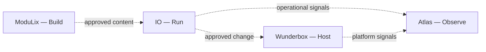

# Portfolio architecture

The Lightning IT technical product portfolio contains four peer products:

| Product                            | Position                | Conceptual verb |
| ---------------------------------- | ----------------------- | --------------- |
| [ModuLix](../modulix/index.md)     | Automation Content      | Build           |
| [IO](../io/index.md)               | Automation Runtime      | Run             |
| [Wunderbox](../wunderbox/index.md) | Infrastructure Platform | Host            |
| [Atlas](../atlas/index.md)         | Observability Platform  | Observe         |

None of these products is a child of another. The verbs describe functional
interaction, not ownership or a mandatory deployment pipeline.

## Optional interaction model

A solution can select ModuLix content, execute approved automation through IO,
apply change to infrastructure associated with Wunderbox, and observe outcomes
through Atlas. It can also use any product independently or integrate it with a
different peer system when the supported release contract allows that.

This public architecture does not claim a specific protocol, shared database,
control plane, product dependency, or supported topology. Each concrete
integration needs its own verified version contract.

Dashed arrows show example information or request flows, not containment,
ownership, or mandatory dependencies.

## Cross-product contract

For every interaction, document:

- **purpose:** the bounded outcome and explicit non-goals;
- **owner:** the provider and consumer decision owners;
- **identity:** authenticated workload, service, and human identities;
- **artifact:** immutable content, schema, and component versions;
- **interface:** supported transport and compatibility contract;
- **data:** fields, classification, validation, retention, and deletion;
- **authorization:** allowed actions, targets, and privilege lifetime;
- **failure behavior:** timeouts, retries, partial completion, and safe stops;
- **verification:** independent provider and consumer outcome checks; and
- **lifecycle:** upgrade ordering, deprecation, recovery, and retirement.

## Architecture principles

### Preserve product boundaries

A shared deployment does not erase ownership. Put code-level instructions in
the component repository, product concepts in the product section, and common
decisions here.

### Separate requested, executed, hosted, and observed state

Content can request a change, a runtime can report completion, a platform can
report resource health, and an observability path can show a signal. These are
different evidence sources. Acceptance relates them through an authorized
decision; it does not collapse them into one status.

### Make failure domains visible

Document which consumers, identities, data, and dependencies can be affected by
one failure or change. Do not publish the detailed production topology; retain
it in the authorized environment architecture.

### Design lifecycle with architecture

Backup, recovery, security, observation, upgrades, and decommissioning are
architecture concerns. Define them before rollout rather than adding them after
a failure.

See [Integration decisions](./integration-decisions.md) for a review template.
