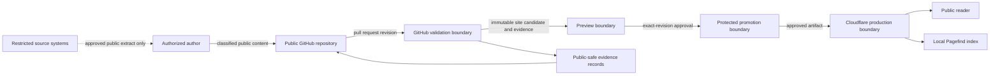

# Target documentation platform and repository architecture

This planning record defines the target architecture for `docs.l-it.io` and its
source repository. It authorizes no implementation, deployment, production
change, product claim, or taxonomy change. The integrated approval in #38 must
accept consequential decisions before implementation begins.

## Architecture states

| State      | Definition                                                                                                   |
| ---------- | ------------------------------------------------------------------------------------------------------------ |
| Current    | The evidence-backed Docusaurus, GitHub Actions, Pagefind, and Cloudflare baseline recorded by #23 and #24.   |
| Transition | Planning records are merged; implementation proceeds through bounded issues after #38 approval.              |
| Target     | One governed public source produces an immutable, validated site candidate promoted through protected gates. |

The transition state must not present a planned component as implemented or a
preview as production.

## System context and trust boundaries



Trust-boundary rules:

1. Restricted sources never flow directly into the public repository, build
   logs, preview, search index, or public evidence.
2. A human-authorized public extract crosses the restricted-to-public boundary
   only after classification, minimization, and claim verification.
3. Pull-request code and content are untrusted input to validation. Workflows
   receive least privilege and no production authority.
4. Preview demonstrates a candidate, not public acceptance or production state.
5. Production promotion requires the exact candidate revision, protected
   approval, successful required checks, and attributable deployment evidence.
6. Public evidence contains safe identifiers and digests, never secrets,
   customer data, private topology, or restricted source text.

## Logical components

| Component                   | Responsibility                                                        | Accountable owner                 | Interface                                      | Source of truth                                      |
| --------------------------- | --------------------------------------------------------------------- | --------------------------------- | ---------------------------------------------- | ---------------------------------------------------- |
| Public content source       | Canonical Markdown, MDX, assets, metadata, and navigation             | Documentation Maintainers         | reviewed Git changes                           | `docs/`, `static/`, `sidebars.ts`                    |
| Architecture and policy     | Publication, trust, lifecycle, and design decisions                   | Documentation Architects          | planning records and accepted ADRs             | root policy files and `docs/architecture/`           |
| Product namespaces          | Product-specific public documentation without cross-product ownership | Product Owners                    | stable routes and shared template contract     | governed product directories under `docs/`           |
| Shared authoring system     | Templates and reusable accessible presentation patterns               | Documentation Maintainers         | Markdown-first template/component contracts    | `templates/`, approved `src/components/`             |
| Validation pipeline         | Deterministic quality, security, accessibility, and content checks    | Repository Maintainers            | locked commands and required GitHub checks     | `package.json`, lockfile, workflows, scripts         |
| Static-site builder         | Render versioned source into one immutable deployable candidate       | Repository Maintainers            | Node/npm build contract                        | Docusaurus configuration and locked dependencies     |
| Search builder              | Index only rendered public pages and expose local search              | Documentation Maintainers         | Pagefind output consumed by site UI            | rendered candidate                                   |
| Evidence producer           | Record safe validation, approval, promotion, and acceptance facts     | Evidence Owner                    | schema-validated digest-bound records          | governed evidence schemas and immutable run metadata |
| Preview service             | Render a candidate for bounded review                                 | Delivery Engineers                | revision-specific preview URL                  | immutable candidate revision                         |
| Promotion controller        | Admit an approved candidate to stable state                           | Production Approver               | protected `develop` → `main` promotion         | GitHub protected branches and environment controls   |
| Production delivery         | Serve approved static output and support rollback                     | Delivery Engineers                | Cloudflare Pages deployment                    | promoted immutable artifact and deployment record    |
| External public authorities | Supply approved public facts such as product terminology              | Named Product or Compliance Owner | attributable, versioned public decision record | authority identified by the governing planning issue |

An interface does not transfer ownership. Shared content is linked or generated
from one canonical record; it is not copied into each product namespace.

## Content and artifact flow

1. An author identifies the canonical public authority and classifies every
   source, asset, link, metadata field, and generated output.
2. The author creates or updates one canonical record using the governed
   template and lifecycle metadata.
3. A feature branch and pull request provide attribution, diff review, issue
   traceability, and an exact revision.
4. Validation checks formatting, types, links, spelling, metadata, licenses,
   dependency risk, content safety, build integrity, responsive behavior,
   accessibility, search, and browser behavior as applicable.
5. The build creates a static candidate, local search index, notices,
   deployment marker, and public-safe validation evidence from the same
   revision.
6. A revision-specific preview supports review. Preview URLs are not canonical
   public claims.
7. Authorized approval binds the accepted document set to its deterministic
   digest. Any material change invalidates that approval.
8. Protected promotion advances the accepted immutable candidate to stable
   state without rebuilding different content.
9. Production acceptance verifies canonical routes, TLS, security headers,
   navigation, search, accessibility, content identity, and rollback readiness.
10. Rollback selects a previously accepted immutable candidate, records the
    reason and operator, verifies restored behavior, and preserves the failed
    deployment evidence for analysis.

## Target repository structure

```text
/
├── docs/
│   ├── architecture/       # platform design and accepted decision context
│   ├── products/<id>/      # one namespace per approved sellable product
│   ├── foundations/<id>/   # shared foundations, never presented as products
│   ├── trust/              # canonical public Trust Center content
│   ├── evidence/           # human-readable Evidence Center content
│   ├── compliance/         # framework-neutral control mappings
│   ├── security/           # public security and publication guidance
│   ├── governance/         # lifecycle, review, and contribution guidance
│   └── reference/          # schemas, inventories, and stable references
├── evidence/
│   ├── source/             # reviewed public-safe evidence inputs
│   ├── generated/          # reproducible outputs; never edited canonically
│   └── schemas/            # machine-verifiable evidence contracts
├── templates/              # canonical authoring templates
├── src/
│   ├── components/         # exceptional accessible reusable UI
│   └── pages/              # shell pages only; canonical prose stays in docs
├── static/                 # reviewed public assets and generated public files
├── scripts/                # deterministic validation and generation tools
└── .github/workflows/      # least-privilege validation and promotion controls
```

The current product directories remain valid during transition. Their movement
or renaming requires the integrated taxonomy decision, redirects, link and
search validation, and a separate implementation change.

### Ownership and extension rules

- Every canonical document has one owning role and one stable identifier.
- Cross-product policy, trust, evidence, and compliance material lives in its
  shared domain and is linked from products.
- A new product receives a unique lower-case route identifier, product owner,
  public authority, documentation entry, and lifecycle record before content is
  added.
- A foundation is not placed in the product namespace or marketed as a product
  unless an authorized taxonomy decision changes its role.
- Generated files identify their generator and inputs and are never the sole
  editable source.
- Redirects preserve established public routes; aliases never create a second
  canonical page.
- Plugins, components, locales, frameworks, and evidence types extend through a
  documented contract, named owner, safe default, validation, and removal path.

## Operational boundaries

| Boundary     | Permitted                                                        | Prohibited                                                         |
| ------------ | ---------------------------------------------------------------- | ------------------------------------------------------------------ |
| Authoring    | verified public facts and safe synthetic examples                | secrets, customer data, private topology, unapproved claims        |
| Pull request | validation with read-only or minimum scoped permissions          | production mutation or implicit approval                           |
| Preview      | candidate review and automated testing                           | canonical publication claim                                        |
| Evidence     | public-safe digests, timestamps, results, and stable references  | credentials, sensitive logs, or unverifiable compliance claims     |
| Promotion    | exact accepted artifact through protected controls               | mutable rebuild, bypass, or unreviewed branch deployment           |
| Production   | static public delivery, monitored acceptance, reversible rollout | authoring, restricted-source access, or undocumented manual change |

## Non-functional requirements

| Quality         | Target requirement                                                                                                | Verification approach                                      |
| --------------- | ----------------------------------------------------------------------------------------------------------------- | ---------------------------------------------------------- |
| Security        | least privilege, pinned dependencies/actions, no restricted data, explicit trust boundaries, safe headers         | workflow inspection, dependency review, CodeQL, CSP checks |
| Accessibility   | WCAG 2.2 Level AA; semantic structure, keyboard access, visible focus, contrast, reduced motion                   | automated axe/Lighthouse plus bounded manual review        |
| Performance     | static delivery; budgets for page weight, rendering, and search; no mandatory third-party runtime dependency      | reproducible build and Lighthouse budgets                  |
| Reproducibility | Node and npm versions, lockfile, deterministic generators, candidate revision, and digest are recorded            | clean checkout build and digest comparison                 |
| Maintainability | Markdown first, one canonical owner, stable routes, schemas, documented extension and deprecation paths           | content tests, ownership review, link and metadata checks  |
| Availability    | production remains a static artifact with monitored canonical routes and a tested previous-artifact rollback path | deployment acceptance and rollback exercise                |
| Portability     | source, search, evidence, and redirects remain exportable; provider-specific configuration stays at adapter edges | clean static export and documented provider handoff        |
| Privacy         | data minimization; no user-specific search telemetry required for core use                                        | content scan and architecture review                       |

Quantitative thresholds and service objectives require an owner and accepted
ADR; this planning record does not invent an SLA or certification.

## Assumptions, constraints, and open decisions

Assumptions:

- GitHub remains the public source and protected change-control boundary.
- Docusaurus and Pagefind remain the transition toolchain.
- Cloudflare Pages remains the delivery provider until an accepted ADR changes
  it.
- Public documentation can be built without runtime access to restricted
  systems.

Constraints:

- #15 remains the authoritative goal.
- `AGENTS.md` controls classification and public safety.
- #24 controls governance, release, approval, and licensing interpretation.
- Product terminology follows the superseding taxonomy decision in #147;
  implementation and route migration remain governed by #135.
- Planning records do not authorize implementation or production changes.

Open decisions:

| Decision                                            | Owner                     | Gate or proposed ADR scope          |
| --------------------------------------------------- | ------------------------- | ----------------------------------- |
| Product/foundation route mapping                    | Product Owner             | #135 migration and compatibility    |
| Locale URL and fallback policy                      | Documentation Maintainers | #33; localization ADR               |
| Evidence retention periods and external storage     | Evidence Owner            | #30; evidence retention ADR         |
| Compliance authority and framework publication rule | Compliance Owner          | #31; compliance mapping ADR         |
| Artifact promotion versus provider rebuild behavior | Delivery Engineers        | #35; immutable deployment ADR       |
| Search version, locale, and stale-result semantics  | Documentation Maintainers | #33; search architecture ADR        |
| Availability and performance thresholds             | Service Owner             | #35; SLO and performance-budget ADR |
| Provider exit and disaster-recovery procedure       | Delivery Engineers        | #35; portability and recovery ADR   |

## Required downstream architecture records

- #26: information architecture, site map, and navigation.
- #27: metadata, lifecycle, review, and versioning state model.
- #29: Trust Center content and ownership model.
- #30: Evidence Center schemas, generation, and retention.
- #31: framework-neutral compliance mapping.
- #33: localization and version-aware search.
- #34: GitHub-derived lifecycle traceability.
- #35: CI/CD, immutable promotion, Cloudflare operations, and rollback.
- #37: dependency graph and implementation-ready work breakdown.
- #38: integrated maintainer approval for the complete planning package.

Consequential choices must be accepted in those records or promoted to an ADR.
Silence is not approval.
